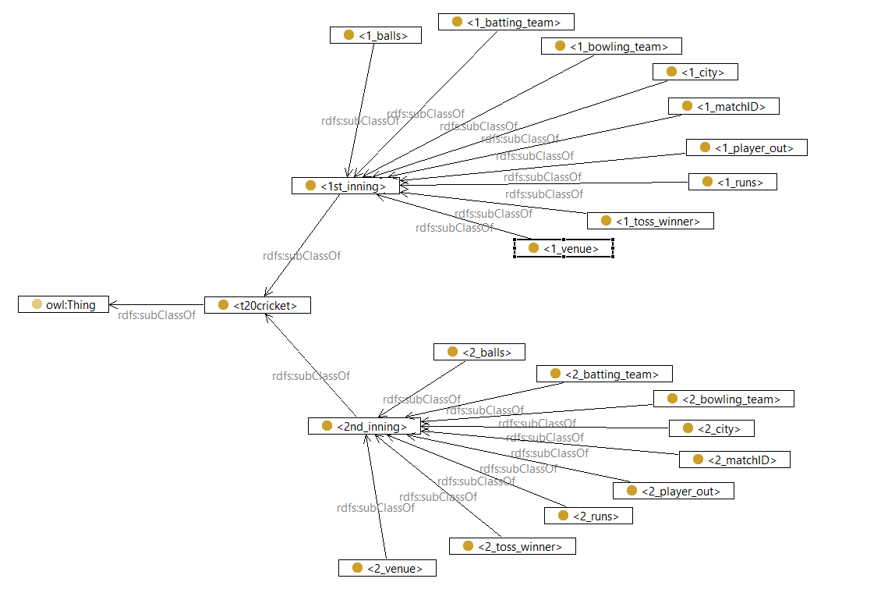

# Semantic-Search-using-Ontology-and-RDFs-for-t20-Cricket
Exploring insights about T20 cricket matches, players, teams using Knowledge base and ontologies

This GitHub repository contains the code and resources for implementing a semantic search system for T20 cricket using ontology, RDFs (Resource Description Frameworks), and SPARQL for querying knowledge graphs. The project aims to enable users to perform advanced search queries, retrieve relevant information, and gain valuable insights about T20 cricket matches, players, teams, and statistics.

### Introduction

This project is based upon a dataset of International T20 cricket where data for each match
is given, identified by a match ID, number of balls, runs, team names (both batting team and
balling team), toss winner, city and venue and no of wickets taken. Firstly, we understood
the data of the given dataset, then loaded that onto a software to form an ontology and
RDF. Next, SPARQL queries were executed to make deductions from the data.

### Tools, Technologies and Programming Concepts Used

1. Top Braid Composer
2. Allegro Graph
3. Protege
4. Ontology
5. RDF
6. SPARQL

### Features

Semantic search capabilities for cricket-related entities and concepts
Advanced search queries using ontology-based reasoning and inference
Efficient storage and retrieval of cricket-related data using RDFs
SPARQL queries for querying the knowledge graph and retrieving relevant information
Integration of cricket datasets for comprehensive analysis and insights
Support for querying and retrieving match statistics, player profiles, team information, and more
Integration with external APIs to fetch real-time cricket data

### Ontologies via Knowledge graph 

### Getting Started

To get started with this project, follow these steps:

Clone the repository: git clone https://github.com/fahad0071/Semantic-Search-using-Ontology-and-RDBMS-for-t20-Cricket.git
Install the required dependencies and libraries.
Prepare the cricket dataset in RDF format, representing relevant information about matches, players, teams, and statistics.
Define the ontology and RDF schemas to capture the domain knowledge and relationships.
Implement the search functionalities and query processing logic using SPARQL.
Build and run the application, ensuring proper integration with the ontology, RDFs, and SPARQL.
Test the search system with various queries and evaluate the results.
For detailed instructions, code explanations, and usage guidelines, please refer to the documentation in the docs folder.

Contributing
Contributions are welcome! If you'd like to contribute to this project, please follow these guidelines:

Fork the repository and create a new branch.
Make your changes and ensure they're properly documented.
Submit a pull request with a detailed description of your changes.

We hope that this repository provides a solid foundation for implementing a semantic search system for T20 cricket using ontology, RDFs, and SPARQL for querying knowledge graphs. Feel free to explore, contribute, and enhance the functionality to enable comprehensive and insightful searches in the world of T20 cricket.

For any questions, please contact us or open an issue.
